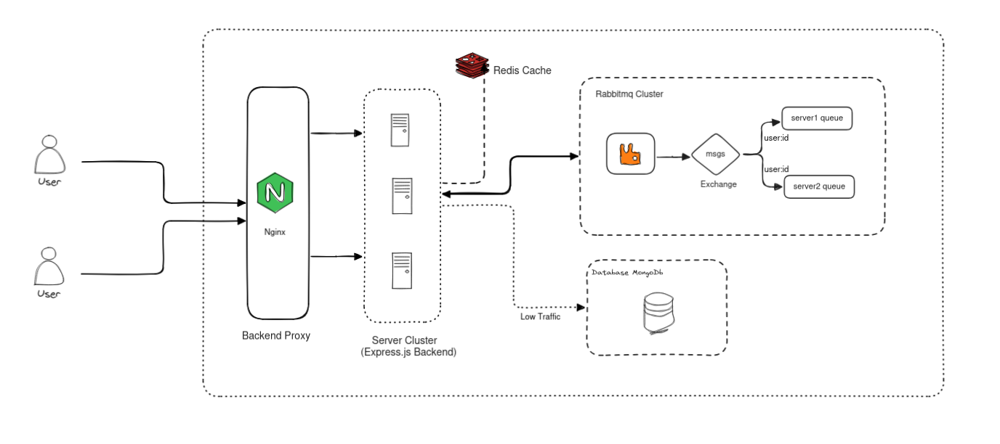
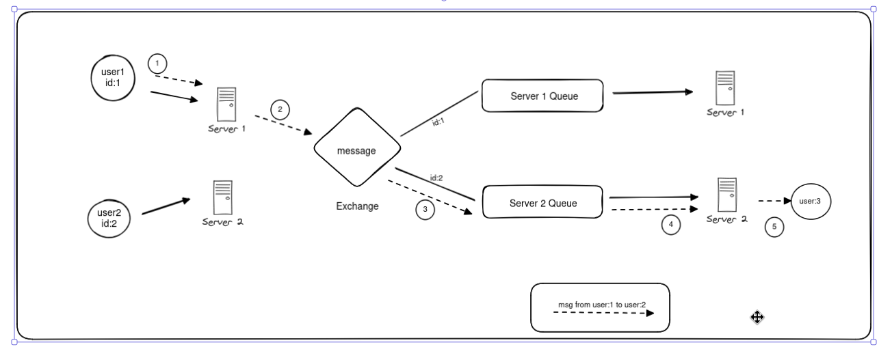

# Distributed Chat Application | VibeTalk

The backend is distributed and horizontally scalable using RabbitMQ for message parsing. Technology used in backend Socket.io, Redis (cache), and RabbitMQ (message buffering). The servers don't need to maintain consistency with each other. It is all handled by RabbitMQ Queue Bindings. See [Architecture](#architecture).

## Features

- Supports one-to-one communication and group chats with full data persistence.
- Uses RabbitMq for message buffering and user sessions tracking.
- Utilizes bucketing strategy to store, retrieve, and send messages faster and more efficiently.
- No complex setup to track user sessions.
- Server don't need to maintain consistency with each other.

## Architecture



- Every Server Node, Uses its own exclusive queue.
- When a user connects to a server node, its binds the queue to the exchange by userId.
- Exchange send the message for a user to every queue binded by its userId.
- Server then sends the message to the user using websocket.
- When a node is down, all the queues and bindings are automatically removed, saving resources and all the users are directed to other active nodes by the load balancer.

## Problems I Faced

Majorly these 2 are the main problems i faced.

1. How to handle so many messages ??

    - I choosed RabbitMQ queue for storing messages before they are handled by the server. Kafka is a overkill for this and redis don't have durability. RabbiMQ comes out to be the best option here.

2. How to know which server is user connected to?
    - Solved it by using a RabbitMQ queue and exchange. For user 1 on server 2, I bind the server queue to the exchange based on userId. I didn't want to add more stack like Redis to create a "Server to User" table, as this would add more complexity. So I came up with this solution. After discussing the potential performance impact of having so many bindings with the RabbitMQ team, i finalized this architecture.

Here is the flow of a message from sender to reciever.


3. **Time synchronization for bucketing**:
    - **Problem**: For bucketing to work properly, servers need to sync time.

## Before Starting This I Did Not Know

- How RabbitMQ works
- AMQP Protocol
- How different distributed systems coordinate.
- Different Schema design patterns like bucket, outliers and approximation.
- MongoDB ObjectId contains a timestamp, making them roughly sortable based on creation time, which is suitable for this case.

                        !! Now I know all of these! 😄

## Journey - Timeline

**Dec 29 - Jan 4**

- Started researching different technologies used in distributed systems, and learned about:
    - Kafka
    - Redis
    - RabbitMQ
    - Nginx

**Jan 4 - Jan 5**

- Set up Docker environment for fast setup
- Read Discord blogs to understand how they work
- Read about WhatsApp's use of ejabberd
- Tried RabbitMQ with a queue for each user [**Failed 1**][Having so many queues caused significant delays during RabbitMQ node restarts.]

**Jan 6**

- Found possible approaches to solve the first two problems
- Prepared architecture diagram
- Studied Discord message schema
- Explored compound keys
- Learned about MongoDB IDs being sortable and their composition

**Jan 7**

Tried RabbitMQ for message and user updates [**Failed 2**][Not ideal if a node goes down, it becomes unaware of who is online]

**Jan 8**

Used RabbitMQ for message delivery and Redis for "Server to User" map [**Failed 3**][Complexity is too high to handle each user's presence. Redis will become a single point of failure and it will require three different stacks (Server, RabbitMQ, Redis) to scale up together]

**Jan 9**

Created a queue for each server and bound it to exchange based on userID
[**Green Go** - Only problem is having so many bindings, solved this by creating multiple exchanges and partitioning users to them by a simple hash function.]

**Jan 11**  
Configured Nginx and WebSockets connection to Nginx, provided server unique ID to make them identifiable.

**Jan 12**  
Learned about Prometheus-Grafana-Loki for metrics collection, logging, and visualization.

## Quickstart

To keep the setup simple, I will provide only one way of doing it. Clone the repo and spin up the Docker container:

```bash
docker compose up --build -d
```

Start the Frontend:

```bash
cd client && npm i && npm run dev
```

## Screenshots

## Tech Stack

- MERN
- WebSocket
- RabbitMQ (AMQP Protocol)
- Redis

## References

- [Popular Chat and Instant Messaging Protocols](https://www.cometchat.com/blog/popular-chat-and-instant-messaging-protocols)
- [How Discord Stores Trillions of Messages](https://discord.com/blog/how-discord-stores-trillions-of-messages)
- [How Discord Stores Billions of Messages](https://discord.com/blog/how-discord-stores-billions-of-messages)
- [MongoDB Indexes](https://www.mongodb.com/docs/manual/indexes/)
- [Schema Design Process](https://www.mongodb.com/docs/manual/data-modeling/schema-design-process/#apply-design-patterns)
- [Schema Design Patterns](https://www.mongodb.com/blog/post/building-with-patterns-a-summary)

## Additional

- [WhatsApp's Architecture and System Design](https://www.cometchat.com/blog/whatsapps-architecture-and-system-design)
- [Popular Chat and Instant Messaging Protocols](https://www.cometchat.com/blog/popular-chat-and-instant-messaging-protocols)
- [ejabberd](https://www.ejabberd.im/)

## Contributing

I'm happy to colaborate. Contact me.
