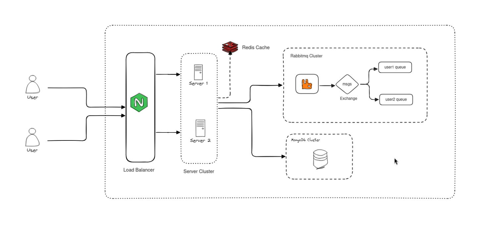

# VibeTalk

# Tech

WebSocket
Rabbitmq
prometheus
grafana+
ELK stack for logging

use discord message schema
invalidate cache when group settings change
create channel for each communication or using boolean.

# References

https://www.cometchat.com/blog/whatsapps-architecture-and-system-design
https://www.cometchat.com/blog/popular-chat-and-instant-messaging-protocols
https://www.ejabberd.im/
https://discord.com/blog/how-discord-stores-trillions-of-messages
https://www.youtube.com/watch?v=S2xmFOAUhsk&t=1s
https://github.com/socketio/socket.io-chat-platform
https://socket.io/get-started/

# This design is for 10K online users.

https://www.mongodb.com/docs/manual/indexes/

docker-compose up --scale restaurant-service=2

testing
https://lodash.com/

MongoDb ObjectId contain timestamp so they are roughly sortable based on creation time.
Which is fine for this case.

# Problems To Solve:

    1. Each Server must know which user is connected to which server.
    2. Server can send that message to appropiate user.

    user -> s1,s2
    u2 ->  s3, s4

Timeline

Learning various commonly used distributed technology

- kafka
- redis
- rabbitmq
- nginx

- setup docker environtment for fast setup
- read discord blogs to understand how they work
- read whatsapp about ejjaberd
- prepare architecture diagram
- read about mongodb id are sortable and their composion
- discord message schema
- compound keys
- tried rabbiq with queue for each user
- tried rabbitmq for message and user updation - not good if a node goes down he becomes unaware who is online.
- using rabbitmq for message delivery and redis for cache channel members and user-server map

for bucketting thing to work properly, server need to sync time.

Can simultaneously handles 10k online users. Benchmarks are availble on the github.
